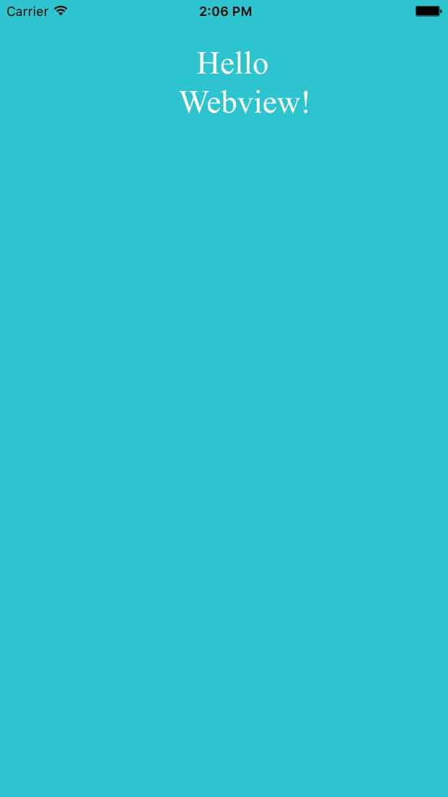
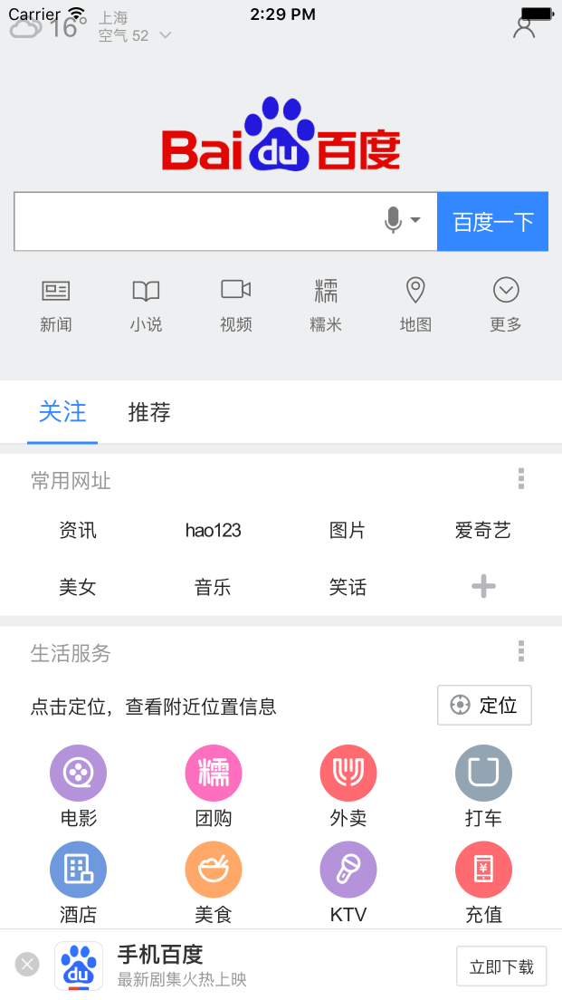
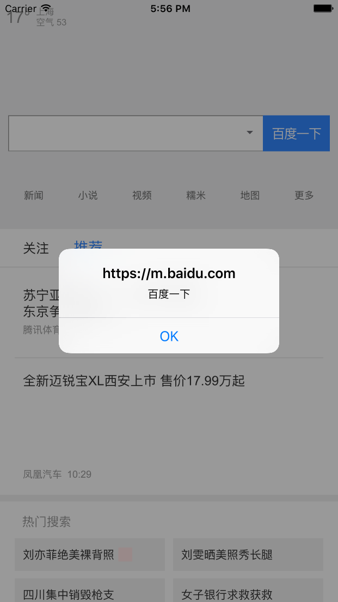

#第二篇 移动前端需要了解的WebView
##第2章 iOS WebView
WebView是什么？我们打开支付宝，可以看到很多第三方的页面，这就是WebView容器。     
很多时候移动前端更多的是和WebView打交道，那么就十分有必要了解WebView的一些特性和工作方式。我们不需要做到向Native开发那样精通，但是可以做到能够掌握基本原理。        
###2.1 UIWebView      
UIWebView是iOS的基本组件，能够使我们App包含和展示Web网页。一般情况下，我们创建一个UIWebView的实例，然后将UIWebView实例添加到当前父容器对象上，最后发送一个请求去加载网页实体。我们还可以通过UIWebView来控制网页的回退和前进，甚至可以设置网页相关的内容属性。     
 
UIWebView提供两种方式加载网页：本地方式和在线方式。
####2.1.1 本地加载
我们可以通过````- (void)loadHTMLString:(NSString *)string baseURL:(NSURL *)baseURL```` 来加载本地网页。使用本地加载方式的好处有：         

+ 可以更快的加载      
+ 可以做离线部署
+ 可以减少网页服务器的压力

但是同样存在不好的地方：              
    
+ 稍微增加了安装包的体积
+ 更新本地文件困难，需要增加本地资源版本控制
+ Native开发和本地开发没有分离

首先，我们开发一个本地网页index.html，代码如下：         

	<!DOCTYPE html>
	<html>
	<head lang="zh">
	  <meta charset="UTF-8">
	  <meta name="viewport" content="width=device-width, initial-scale=1.0, maximum-scale=1.0, minimum-scale=1.0, minimal-ui"/>
	  <title>WebView</title>
	  <style type="text/css">
	  	html,body{width:100%;height:100%;background-color:#2DC4CF;color:#fff;}
	  	div{margin-top:40px;width:100px;text-align: center;margin-left:auto;margin-right:auto;font-size:30px;}
	  </style>
	</head>
	<body>
		<div> Hello Webview!</div>
	</body>
	</html>
我们在ViewController的viewDidLoad方法中加载本地html，代码如下：      
        
    UIWebView *webview = [[UIWebView alloc]init];
    webview.backgroundColor = [UIColor clearColor];
    //文件路径
    NSString *filePath = [[NSBundle mainBundle]pathForResource:@"index" ofType:@"html"];
    //文件内容
    NSString *content = [NSString stringWithContentsOfFile:filePath encoding:NSUTF8StringEncoding error:nil];
    
    //获取根目录
    //以确保加载相应的js、css等文件路径正确
    NSString *path = [[NSBundle mainBundle] bundlePath];
    NSURL *baseURL = [NSURL fileURLWithPath:path];

    //加载HTML内容字符串
    [webview loadHTMLString:content baseURL:baseURL];
    //设置WebView的位置和大小
    webview.frame = [[UIScreen mainScreen]bounds];
    //将WebView添加到父容器中
    [self.view addSubview:webview];
        
   
   使用cmd + R快捷键运行改项目，效果2－1：           
       
          
图2-1 本地加载网页        

当然，这里我们使用简单的字符串也是可以的，例如：          

    UIWebView *webview = [[UIWebView alloc]init];
    webview.backgroundColor = [UIColor clearColor];
    [webview loadHTMLString:@"<div><h1>hello world</h1></div><h2>iOS WebView</h2>" baseURL:nil];
    webview.frame = [[UIScreen mainScreen]bounds];
    [self.view addSubview:webview];
 
####2.1.2 网络加载     
最为常见的情况是，我们需要使用网络加载网页，比如App中嵌入第三方合作机构的网页。 网络加载的好处如下：      

+ 可以更新及时
+ 不影响包体积
+ 可以嵌入更多的第三方应用
+ 动态链接配置更为方便       

当然，网络加载也有一定的弊端，比如：    

+ 资源请求耗时较长
+ 如果没有做好缓存，导致流量浪费严重
+ 离线状态不佳   

如果需要通过网页加载网页，则需要调用````- (void)loadRequest:(NSURLRequest *)request````方法。具体代码如下：      

	 UIWebView *webview = [[UIWebView alloc]init];
	 webview.backgroundColor = [UIColor clearColor];
	 NSURLRequest *request = [NSURLRequest requestWithURL:[NSURL URLWithString:@"https://www.baidu.com/"]];
	 [webview loadRequest:request];
	    
	 webview.frame = [[UIScreen mainScreen]bounds];
	 [self.view addSubview:webview];
这里我们加载了百度的首页，具体效果如图2-2所示：      
      

####2.1.3 其他方法和属性      
UIWebView提供了很多使用的方法和属性。

+ ````- (void)stopLoading ````：停止加载网页     
+ ````- (void)goBack````： 控制历史纪录回退
+ ````- (void)goForward```：控制历史纪录前进     
+ ````@property(nonatomic, readonly, getter=canGoBack) BOOL canGoBack````：历史纪录能否回退，可读属性，BOOL类型       
+ ````@property(nonatomic, readonly, getter=canGoForward) BOOL canGoForward```：历史纪录能否前进，可读属性，BOOL类型       

当然UIWebView还有很多实用的方法和注意的地方，比如去掉默认呼叫手机号，避免将UIWebView潜入UIScrollView，还可以展示PDF、Keynote等，UIWebView中还有一个restorationIdentifier属性，该属性可以用于历史状态的恢复。但是作为前端开发者我们不需要了解那么多的知识。    
这里，我们重点掌握````- (NSString *)stringByEvaluatingJavaScriptFromString:(NSString *)script````方法,例如：          

	[webview stringByEvaluatingJavaScriptFromString:@"alert(document.title)"];       
	[webview stringByEvaluatingJavaScriptFromString:@"document.title='vczero'"];   
	
####2.1.3 UIWebViewDelegate协议
提到UIWebView，不可或缺的是UIWebViewDelegate。UIWebViewDelegate也是后面我们实现Javascript Bridge重要方式。            


+ ````- webView:shouldStartLoadWithRequest:navigationType:````：是否加载该请求，针对不同的请求过滤。
+ ````- webViewDidStartLoad:````：WebView加载开始后执行该函数
+ ````- webViewDidFinishLoad:````：WebView加载完毕后执行该函数
+ ````- webView:didFailLoadWithError:````：WebView加载错误捕捉函数      

如何使用UIWebViewDelegate呢？       
首先，我们在ViewController.h中对接UIWebViewDelegate协议，代码如下：          

	#import "ViewController.h"

	@interface ViewController (){
	    UIWebView *webView;
	}
	@end

	@implementation ViewController

	- (void)viewDidLoad {
	    [super viewDidLoad];
	    webView = [[UIWebView alloc]init];
	    webView.backgroundColor = [UIColor clearColor];
	    NSURLRequest *request = [NSURLRequest requestWithURL:[NSURL URLWithString:@"https://m.baidu.com/"]];
	    [webView loadRequest:request];
	    webView.frame = [[UIScreen mainScreen]bounds];
	    //设置代理
	    webView.delegate = self;
	    [self.view addSubview: webView];
	}

	- (void)webViewDidFinishLoad:(UIWebView *)webView{
	    NSLog(@"网页加载完毕");
	    [webView stringByEvaluatingJavaScriptFromString:@"alert(document.title)"];
	    [webView stringByEvaluatingJavaScriptFromString:@"document.title='vczero'"];
	}

	- (void)webViewDidStartLoad:(UIWebView *)webView{
	    NSLog(@"网页开始加载");
	}

	- (void)webView:(UIWebView *)webView didFailLoadWithError:(NSError *)error{
	    NSLog(@"网页加载失败");
	}

	-(BOOL)webView:(UIWebView *)webView shouldStartLoadWithRequest:(NSURLRequest *)request navigationType:(UIWebViewNavigationType)navigationType{
	    NSLog(@"%@", request);
	    return YES;
	}

	- (void)didReceiveMemoryWarning {
	    [super didReceiveMemoryWarning];
	}

	@end        
	
这里我们用到了stringByEvaluatingJavaScriptFromString函数，可以将JavaScript代码作为字符串传入。为了更加直观的表现，这里获取文档的标题。代码运行效果如图2-3所示：      
          
图2-3 百度M站首页              	
	   
###2.2 WKWebView     
在iOS 8及其以后的版本，建议使用WKWebView代替UIWebView，这样性能更高，加载速度提升了，内存反而降低了。所以苹果建议开发者使用WKWebView代替UIWebView。    
            
####2.2.1 WKWebView加载网页 
      
	WKWebView *webView = [[WKWebView alloc]initWithFrame:self.view.bounds];
	[webView loadRequest:[NSURLRequest requestWithURL:[NSURL URLWithString:@"https://m.baidu.com/"]]];
	[self.view addSubview:webView];     

####2.2.2 WKNavigationDelegate协议     

####2.2.3 WKUIDelegate

####2.2.4 WKScriptMessageHandler

####2.2.5 WKWebView加载JS

 
###2.3 Javascript Bridge         
  
###2.4 JavaScript Core         

